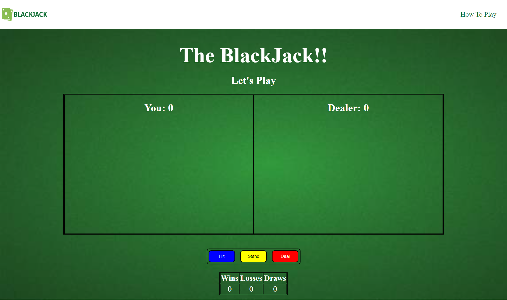

# The BlackJack Game

## Summary
It is a slight cariation of the classic card game The Blackjack. I made this game as a Front-End Web Developer project .

## Installation
To run this application, download the GitHub zip file or clone the repository. Then open a browser window and within it open the index.html file in the directory of your application.

## Tools used in this game:
HTML5 
CSS
JavaScript

## How to play the game

### Object of the Game
Each participant attempts to beat the dealer by getting a count as close to 21 as possible, without going over 21.

### Card Values/Scoring
An ace is worth 1, Face cards: Jack=11, Queen=12, King=13 and any other card is its pip value.

### The User's Play
The player goes first and must hit atleast once and then decide whether to "stand" (not ask for another card) or "hit" (ask for another card in an attempt to get closer to a count of 21, or even hit 21 exactly). Thus, a player may stand on the first cards dealt to them, or they may hit and get additional cards, one at a time, until deciding to stand on the total (if it is 21 or under), or goes "bust" (if it is over 21). In the latter case, the player may lose or end up in a draw depending on dealer's score.

### The Dealer's Play
Once the player clicks the stand button the dealer's card turns randomly and if the total is 17 or more, it must stand. If dealer's score mathes the player's score its a draw, if the score is less than the player the player wins otherwise the player loses. 

### The Deal
Once the result for a round is displayed player may seek for another round and may click the "Deal" button in order to reset the table.

### Scoreboard
The total number of wins, draws and loses are updated in a scoreboard below the hit,stand and deal button.

